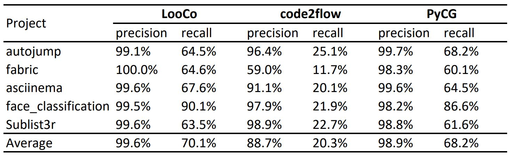

# LooCo's subjects

We collect two different subjects for our empirical study on DC issues and common developer practices respectively.

[Subject-A on DC Issues](subjectA/subjectA.html)

[Subject-B on Open Projects](subjectB/subjectB.html)

# Call Graph Tool Performance

